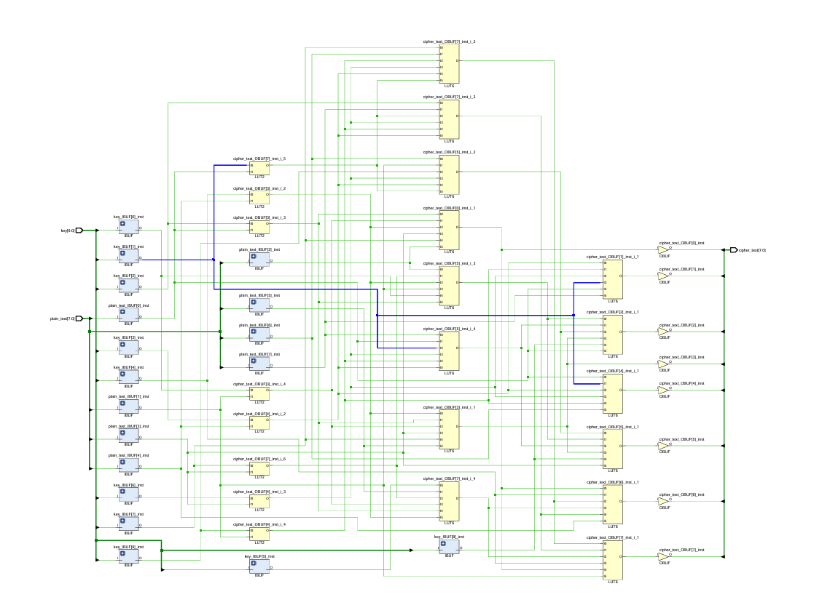

# S-DES in Verilog

Implementing the Simplified Data Encryption Standard (S-DES) algorithm in Verilog HDL.

## Repository Structure

- `main/sdes_top.v` - Top-level S-DES encryption module
- `main/key_generation.v` - Generates subkeys `K1` and `K2` from a 10-bit key
- `main/initial_permutation.v` - Initial permutation (IP)
- `main/feistel_k.v` - Feistel round function (`fk`) with S-boxes and P4
- `main/switch.v` - SW stage (left/right 4-bit swap)
- `main/ip_inverse.v` - Inverse initial permutation (IP⁻¹)
- `main/sdes_tb.v` - Testbench

## Top Module Interface

```verilog
module sdes_top(
    input  [7:0] plain_text,
    input  [9:0] key,
    output [7:0] cipher_text
);
```

## Algorithm Flow

1. `plain_text` → Initial Permutation (IP)
2. Round 1 Feistel function with `K1`
3. Switch halves (SW)
4. Round 2 Feistel function with `K2`
5. Inverse Initial Permutation (IP⁻¹) → `cipher_text`

## Schematic




## Simulation

Use any Verilog simulator (Vivado, Icarus Verilog, ModelSim, etc.).

### Example (Icarus Verilog)

```bash
iverilog -o sdes_sim main/*.v
vvp sdes_sim
```

## Testbench

The testbench applies multiple key/plaintext vectors and observes `cipher_text` from `sdes_top`.

## Notes

- Design is combinational (no clock/reset in current implementation).
- Keep consistent bit-ordering when validating against reference S-DES examples.
